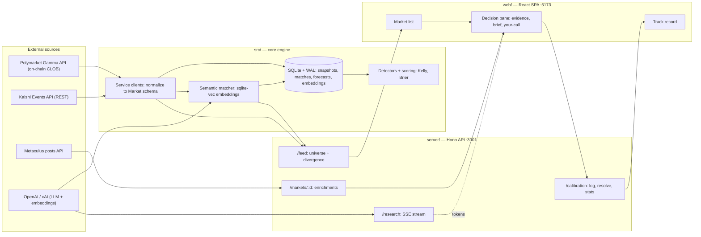
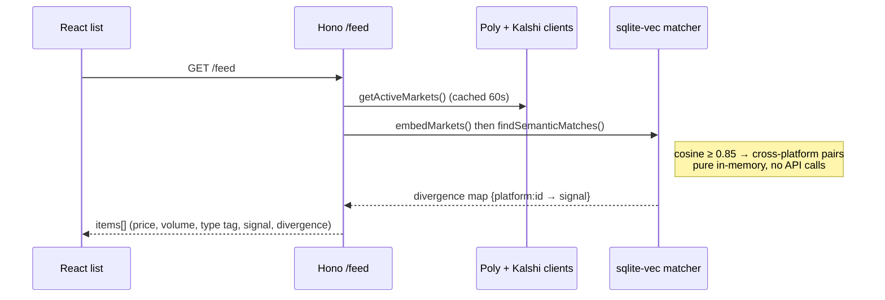
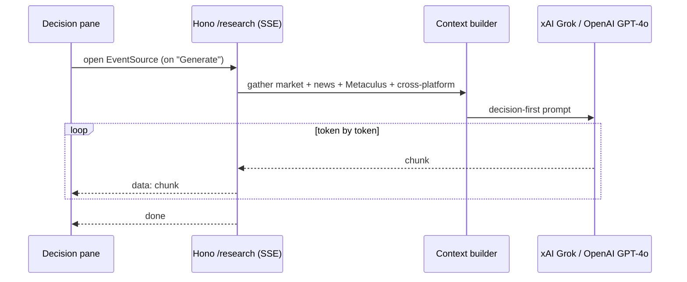

# Architecture & Data Flow

How data moves from three external markets into a single research terminal. Diagrams are
Mermaid (render on GitHub). For the recruiter version see [PORTFOLIO.md](./PORTFOLIO.md);
for the interview talking points see [INTERVIEW-WALKTHROUGH.md](./INTERVIEW-WALKTHROUGH.md).

## System overview



## The core abstraction: one `Market` type

Three sources structure their data completely differently:

| Source | Shape | Prices | Volume unit |
|--------|-------|--------|-------------|
| Polymarket | on-chain CLOB, Gamma REST | decimal strings | **dollars** |
| Kalshi | events → markets, REST | cents → `_dollars` strings | **contracts** |
| Metaculus | community/recency-weighted posts | 0–1 floats | n/a |

Every client normalizes into one Zod-validated `Market` (`src/types/market.ts`): `id`,
`platform`, `question`, `outcomes`, `prices`, `closeDate`, `volume`, `liquidity`, `metadata`.
The hard part is semantic, not syntactic — e.g. Kalshi reports *contracts* while Polymarket
reports *dollars*, so Kalshi volume is converted to approximate USD (`volume_fp × price`)
to make the two sortable on one axis. Multi-outcome Kalshi events repeat the event title on
every market, so the actual option name is pulled from `yes_sub_title`.

## Two request lifecycles worth knowing

**1. The list (`GET /api/opportunities/feed`)** — the full universe plus server-computed
cross-platform divergence:



Divergence is computed **once on the server** and attached to every market, so the list's
Signal/Gap columns are populated and sortable — not derived from per-row clicks. (It lights
up only when a real gap exists; right now there are ~0, which is the whole pivot story.)

**2. The AI brief (`GET /api/markets/:id/research`)** — streamed over Server-Sent Events:



Briefs are **on-demand** (a button, not auto-run) to avoid burning tokens on markets you
don't care about, and stream token-by-token so the pane fills as the model writes.

## Three TypeScript projects

`src/` (engine), `server/` (API), `web/` (SPA) each have their own `tsconfig` and typecheck
independently — the engine has no React or HTTP dependency and is reused by the server, the
CLI dashboard, and the Bree scheduler. `npm run check` runs all three typechecks + the Vite
build + 405 tests.

## Persistence

SQLite (better-sqlite3, WAL mode) holds `market_snapshots` (price history), `matched_markets`,
`user_forecasts` (calibration), and `market_embedding_meta` (1536-dim vectors via sqlite-vec).
Embedded SQLite is the deliberate choice for a single-server project — no vector-DB infra,
embeddings live in the same file as the data. Postgres/Turso would be the multi-user swap.
```

